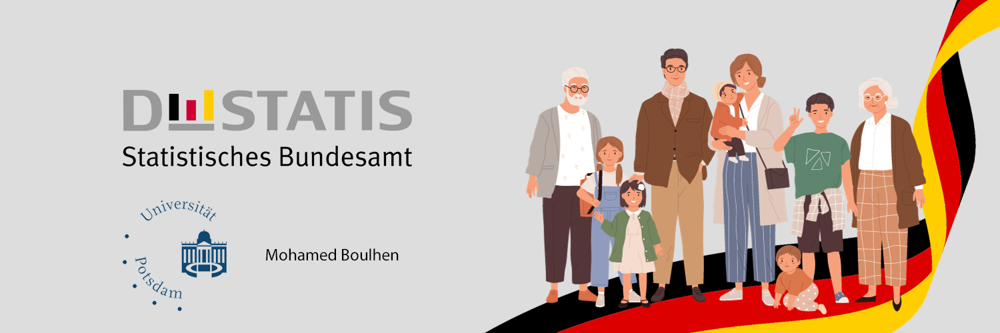

# Naturalisation Trends in Germany

## Overview:

This project explores naturalization trends in Germany from 2010 to 2022 using data from the official source (www-genesis.destatis.de). The goal of this analysis is to gain insight into the cultural diversity and integration of naturalized citizens in Germany.

## Usage Guide:

1. Clone the repository.
2. Ensure you have Python and Jupyter Notebook installed.
3. Open the Jupyter Notebook file `Naturalisation_Trends_Germany.ipynb`.
4. Follow the computational narrative to explore the naturalization trends in Germany.
5. For any questions or issues, feel free to contact Mohamed Boulhen at mohamed.boulhen@uni-potsdam.de

## Data:

The project data is stored in the data/ directory. It includes information on naturalizations in Germany, including the year of naturalization, country of origin, gender, and age group of naturalized citizens.

## Analysis:

The project analysis is contained in Jupyter Notebooks located in the src/ directory. Each notebook focuses on a specific aspect of the analysis, such as trend analysis, regional distribution, gender differences, and age demographics.

## Contact Information:

- Mohamed Boulhen
- mohamed.boulhen@uni-potsdam.de

Feel free to reach out if you have any questions or suggestions regarding the project.

## License:
This project is licensed under the MIT License (LICENSE.md). See the (LICENSE.md) file for more details.

## Citation:
For citation information, please refer to the Citation File (CITATION.cff).

